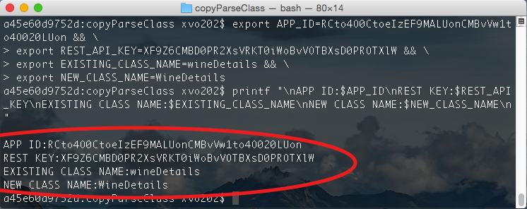

#Copy Parese Class

This script enables you to copy / rename a Parse.com class using the Parse Rest API.

##Usage
- install required gem `$ gem install httparty`
- `./copyClass.rb`

##Detailed Set-up Instructions
- Clone this repository `git clone https://github.com/aln787/copyParseClass.git`
- Change to directory containing the repo `cd copyParseClass`

- Set Environment Variables
  - Copy this over to a text editor and replace the values in <> with your actual values from Parse.
  - **Parse keys can be found here: (`https://www.parse.com/apps/<your app name>/edit#keys`)
  - Parse Class info can be found here: (`https://www.parse.com/apps/<your app name>/collections`).
	
	```
export APP_ID=<your parse app id> && \
export REST_API_KEY=<your parse rest api key> && \
export EXISTING_CLASS_NAME=<existing parse class name> && \
export NEW_CLASS_NAME=<desired name for new parse class>
	```
	
  - Then copy the modified text, with your app details and execute in the terminal.
  - Print and review environment variables to ensure they look correct.

	```
$ printf "\nAPP ID:$APP_ID\nREST KEY:$REST_API_KEY\nEXISTING CLASS NAME:$EXISTING_CLASS_NAME\nNEW CLASS NAME:$NEW_CLASS_NAME\n"
	```
	- Example Output:
	- 
	-**Example Values that need to be reviewd are in the red circle.
- Install required gem 
  - `$ gem install httparty`
- All set, now copy the Parse.com class you specified above ("EXISTING_CLASS_NAME") with this script:
	- `./copyClass.rb `
	
	
